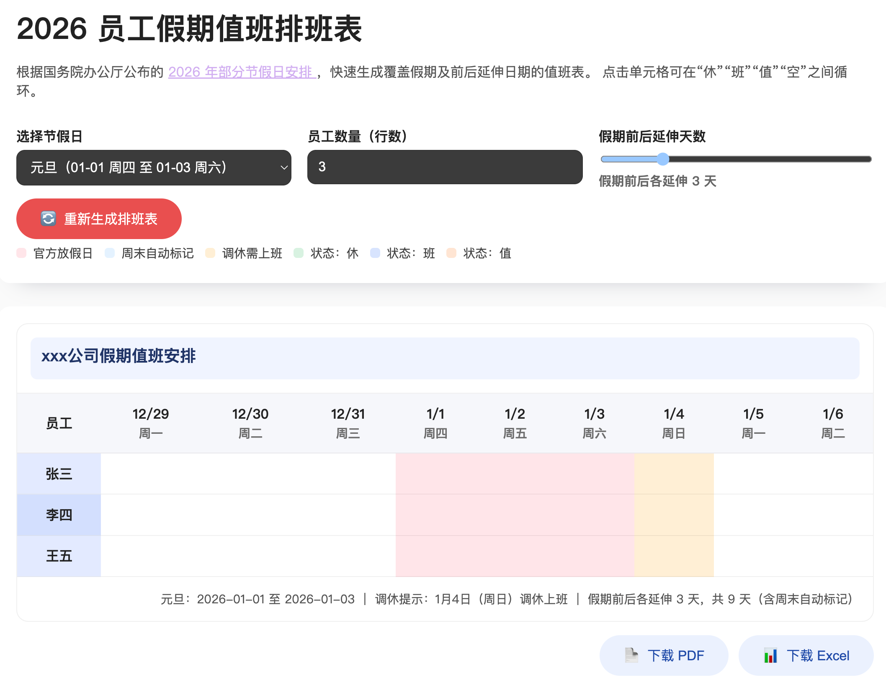

## 员工假期值班排班表（2026）

本项目基于国务院办公厅发布的 **2026 年部分节假日安排**（[国办发明电〔2025〕7 号](https://www.gov.cn/zhengce/zhengceku/202511/content_7047091.htm)）制作，可快速生成覆盖节假日及延伸日期的在线排班表。

### 使用方式

```bash
python3 -m pip install --upgrade pip  # 如需
python3 main.py --port 8700           # 可修改端口
```

运行后浏览器将自动打开 `http://127.0.0.1:8700/`（可通过 `--no-open` 关闭自动打开）。

在页面中可以：

- 选择 2026 年的法定节假日；
- 设置展示的员工行数（可直接编辑单元格录入姓名）；
- 调整假期前后延伸天数（默认 3 天，最大 14 天），周末自动标记为放假；
- 点击单元格在“休”“班”“值”“空”之间循环标记，辅助排班；
- 导出排班结果为 PDF（含图例）或 Excel（包含图例工作表）。

本项目为纯前端实现，所有排班信息仅在浏览器本地生成，不会上传至任何服务器，请放心使用。

在线体验地址：https://dutyboard.nops.icu


